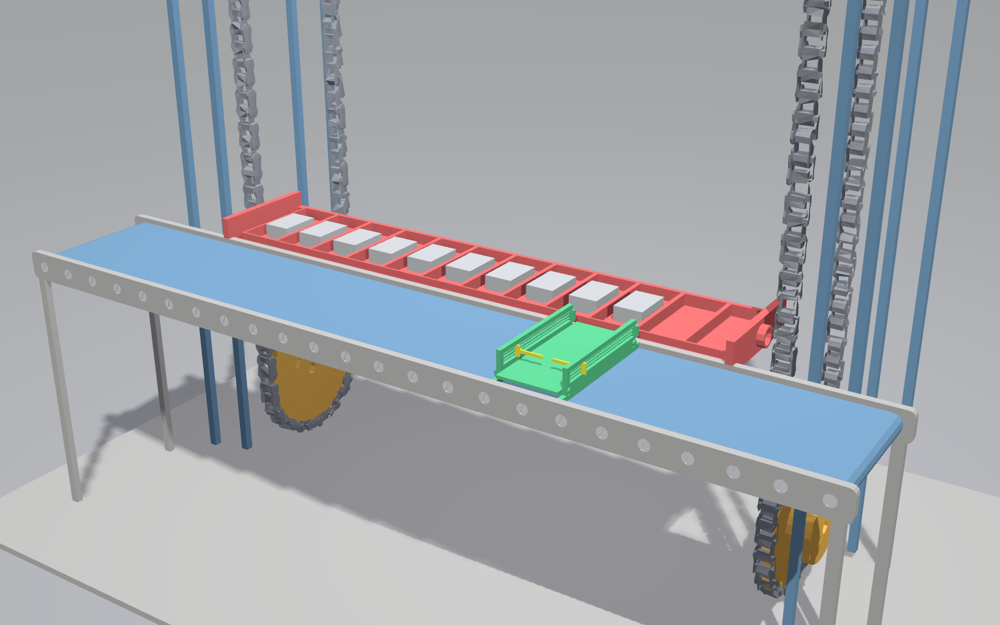
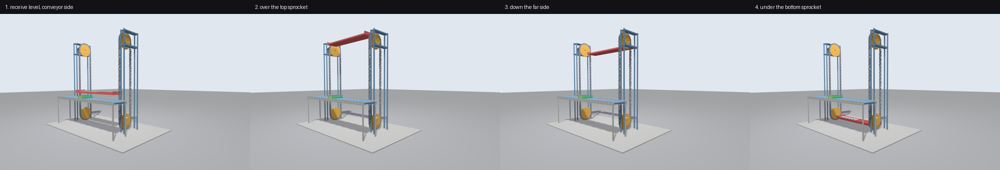

# Assemforchouk — Gazebo simulation

Full simulation of the Assemforchouk **vertical chain-lift AS/RS cell**: a roller
in-feed conveyor with a sliding carriage and transfer pusher, and a two-tower
chain lift carrying an extending shelf, inside a 7.7 x 4.6 x 6.2 m cell.

Rebuilt from the SolidWorks URDF export in the parent folder. The export could
not be simulated as-is — see [docs/RECONSTRUCTION.md](docs/RECONSTRUCTION.md)
for exactly what was wrong and what changed.





* **ROS 2 Jazzy** + **Gazebo Harmonic (gz-sim 8)** + `gz_ros2_control`
* Four position-controlled prismatic axes, driven by a `JointTrajectoryController`
* Rigid-body payloads (cartons) that ride the carriage and transfer to the shelf
* Runs at **real-time factor 1.0** with a 1 ms physics step

---

## Build

The workspace lives at `/home/yassine/Downloads/nrw_repo/Assemforchouk/sim`.
Every command below assumes you are in that directory:

```bash
cd /home/yassine/Downloads/nrw_repo/Assemforchouk/sim
```

```bash
./build.sh
```

`build.sh` regenerates the meshes from `../meshes` if they are missing, then runs
`colcon build`. Needs `numpy` and `scipy` for the mesh step.

## Run

`source install/setup.bash` is what puts `assemforchouk_sim` on the ROS search
path — without it `ros2 launch` only sees `/opt/ros/jazzy` and reports
`package 'assemforchouk_sim' not found`. It is needed once per new terminal.

```bash
source install/setup.bash && ros2 launch assemforchouk_sim gazebo.launch.py demo:=true
```

| launch argument | default | meaning |
|---|---|---|
| `gui` | `true` | `false` runs the server headless |
| `demo` | `false` | run the automatic storage/retrieval work cycle |
| `payload` | `true` | pre-load grey packages into the comptoir slots (all spawned at once) |
| `rviz` | `false` | also open RViz2 |
| `paused` | `false` | start paused |
| `world` | `worlds/assemforchouk.sdf` | world file |

Model only, no physics — useful for checking kinematics with joint sliders:

```bash
ros2 launch assemforchouk_sim display.launch.py
```

## Drive it

One axis at a time:

```bash
ros2 run assemforchouk_sim jog.py lift 1.8
```

```bash
ros2 run assemforchouk_sim jog.py carriage_slide -1.2 --time 4
```

The full work cycle (carriage to the transfer station, shelf out, pusher
transfer, shelf in, lift to storage level, deposit, return):

```bash
ros2 run assemforchouk_sim cycle_demo.py --ros-args -p loops:=3 -p speed:=1.5
```

More packages:

```bash
ros2 run assemforchouk_sim spawn_payload.py --ros-args -p where:=shelf -p count:=8
```

Raw trajectory, if you would rather not use the helpers:

```bash
ros2 topic pub --once /cell_controller/joint_trajectory trajectory_msgs/msg/JointTrajectory "{joint_names: [carriage_slide, pusher_extend, lift, shelf_extend], points: [{positions: [1.6, 0.0, 2.0, -0.5], time_from_start: {sec: 8}}]}"
```

---

## The machine

```
world ──fixed── base_link ┬── carriage_slide (+X) ── carriage ── pusher_extend (+X) ── pusher
                          └── lift           (+Z) ── lift_carriage ── shelf_extend (+Y) ── shelf
```

| joint | axis | limits (m) | effort | velocity | what moves |
|---|---|---|---|---|---|
| `carriage_slide` | +X | -1.90 … 3.40 | 1500 N | 1.0 m/s | platform along the roller table |
| `pusher_extend` | **+Y** | 0.00 … **1.05** | 600 N | 0.5 m/s | two transfer blades, stroking *across* the conveyor |
| `lift` | +Z | **-2.05 … 4.10** | 8000 N | 0.8 m/s | carrier position on the chain loop |
| `shelf_extend` | **-Y** | **-0.15 … 1.15** | 3000 N | 0.6 m/s | comptoir out/in — **positive extends toward the conveyor** |

At `shelf_extend = 1.055` the shelf deck abuts the carriage deck edge to edge, so
the shelf is brought alongside before the pusher strokes.

### How the cell works

```
  1. carriage runs LEFT to the infeed and RECEIVES a package into its channel
  2. carries it RIGHT, stopping lined up on one of the 12 comptoir slots
  3. shelf comes alongside on the conveyor-side chain run
  4. pusher strokes across (+Y) and RELEASES the package into the slot
  5. the carrier CIRCULATES the whole loop - up the conveyor side, over the top
     sprocket, down the far side, under the bottom sprocket - and arrives back
     at the receive level for the next package
```

### The paternoster loop

`lift` and `shelf_extend` together place the carrier anywhere on the chain loop —
they are not a hoist and a telescope, they are the two coordinates of the loop:

| loop feature | `shelf_extend` | `lift` |
|---|---|---|
| conveyor-side vertical run | 1.042 | varies |
| far-side vertical run | -0.038 | varies |
| top sprocket centre | 0.502 | 3.495 |
| bottom sprocket centre | 0.502 | -1.499 |

Sprocket wrap radius is 0.527 in `lift` and 0.540 in `shelf_extend`, measured off
`base_chain.stl` and `base_drum.stl`. The bottom wrap is flattened to 0.460 so
the deck clears the floor slab by 27 mm. `paternoster_loop()` in
`scripts/cycle_demo.py` emits the whole circulation as one 23-point trajectory.

The carrier stays level all the way round — both joints are prismatic, so it
never tips, which is what a real paternoster carrier does.

The loop starts and ends on exactly the same value (`shelf_extend = 1.055`), and
`shelf_extend` is held there for every other step of the cycle, so the carrier
waits in place for the carriage rather than stepping out and back between
packages. Its only movement is one clean circulation per package.

The comptoir is divided by 11 dividers (30 mm wide, 320 mm pitch) into twelve
290 mm slots. `carriage_slide` values that line the channel up on each slot are
in `SLOT_SLIDE` in `scripts/cycle_demo.py`. Repeated cycles walk along the slots,
so the shelf fills up.

The 1.05 m stroke is what makes the transfer stick: a shorter one leaves the
package balanced on the seam between the two decks, and the shelf slides out from
under it when it retracts. At 1.05 m the package lands in the middle of the shelf
deck and seats in its slot. The blades pass 16 mm above the divider tops.

Masses come from the SolidWorks export: shelf 105 kg, carriage 14.7 kg,
pusher 0.15 kg, structure 2259 kg.

### Controllers

| name | type | state |
|---|---|---|
| `joint_state_broadcaster` | `joint_state_broadcaster/JointStateBroadcaster` | active |
| `cell_controller` | `joint_trajectory_controller/JointTrajectoryController` | active |
| `jog_controller` | `position_controllers/JointGroupPositionController` | loaded, inactive |

`jog_controller` claims the same command interfaces as `cell_controller`, so only
one can run. To switch:

```bash
ros2 control switch_controllers --deactivate cell_controller --activate jog_controller
```

then publish straight to `/jog_controller/commands`.

---

## Layout

```
sim/
├── build.sh
├── docs/RECONSTRUCTION.md        what changed vs. the SolidWorks export, and why
├── tools/
│   ├── build_meshes.py           segment + assign + decimate the source STLs
│   └── kin.py                    forward kinematics of the exported joint tree
└── src/assemforchouk_sim/
    ├── urdf/                     assemforchouk.urdf.xacro + ros2_control + gazebo
    ├── meshes/                   10 rebuilt STLs, 2.0 MB total
    ├── config/controllers.yaml
    ├── worlds/assemforchouk.sdf
    ├── launch/                   gazebo.launch.py, display.launch.py
    ├── scripts/                  cycle_demo.py, jog.py, spawn_payload.py
    └── rviz/
```

Regenerating the meshes from the original CAD STLs:

```bash
python3 tools/build_meshes.py
```

It caches the segmentation in `tools/.seg_cache.pkl`; delete that file to force a
full re-segmentation (about a minute).

---

## Known limits

* The transfer geometry was **changed from the CAD on request** — pusher axis
  turned across the conveyor, stroke more than doubled, shelf travel reversed,
  compartments repeated along the whole comptoir. See
  [docs/RECONSTRUCTION.md §6](docs/RECONSTRUCTION.md).
* The decks are not level — the shelf deck sits 83 mm below the carriage deck, so
  a pushed package drops that step rather than sliding across flat. It seats
  correctly, but it is a drop, not a slide.
* Packages are held by friction only; there is no latch or gripper.
* The chain links are **static geometry** — the lift is a prismatic axis, so the
  chains do not visibly move. Correct for control, but not a chain animation.
* Collision is box primitives, not the visual meshes. Contact is approximate at
  the centimetre scale.
* The shelf carries payloads by friction; there is no gripper or latch.
* `docs/RECONSTRUCTION.md` §6 lists everything that is synthesised rather than
  taken from the CAD.
