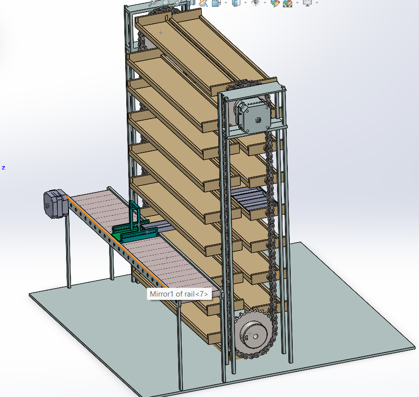
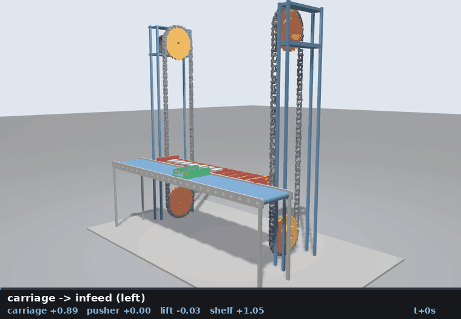

# NRW Makeathon — Gazebo Simulation

> **Part 2 of 2** — Gazebo simulation of the vertical chain-lift AS/RS storage cell.
> See the companion repository [NRW_Makeathon](https://github.com/yassinechouk/NRW_Makeathon) for the full project (computer vision + simulation).

Full simulation of the **vertical chain-lift AS/RS cell**: a roller in-feed conveyor with a sliding carriage and transfer pusher, and a two-tower chain lift carrying an extending shelf, inside a 7.7 × 4.6 × 6.2 m cell.

Rebuilt from the SolidWorks URDF export — see [`docs/RECONSTRUCTION.md`](docs/RECONSTRUCTION.md) for a precise record of what was wrong and what changed.

---

## Gallery

### Original CAD Design



### One complete work cycle



Recorded from cycle 3 of `demo:=true` — package reception through the full paternoster circulation and back to the receive pose. 68.8 s of simulation at 4.6×.


---

## Stack

| Component | Version |
|---|---|
| ROS 2 | **Jazzy** |
| Gazebo | **Harmonic (gz-sim 8)** |
| Control | `gz_ros2_control` — `JointTrajectoryController` |

- Four position-controlled prismatic axes
- Rigid-body payloads (cartons) that ride the carriage and transfer to the shelf
- Runs at **real-time factor 1.0** with a 1 ms physics step

---

## Build

```bash
./build.sh
```

`build.sh` regenerates the decimated meshes from `../meshes` if missing (needs `numpy` and `scipy`), then runs `colcon build --symlink-install`.

---

## Run

`source install/setup.bash` is required once per new terminal to put the package on the ROS search path.

```bash
source install/setup.bash && ros2 launch nrw_cell_sim gazebo.launch.py demo:=true
```

### Launch arguments

| argument | default | description |
|---|---|---|
| `gui` | `true` | `false` runs the server headless |
| `demo` | `false` | run the automatic storage/retrieval work cycle |
| `payload` | `true` | pre-load grey packages into the comptoir slots |
| `rviz` | `false` | also open RViz2 |
| `paused` | `false` | start paused |
| `world` | `worlds/nrw_cell.sdf` | world file |

Model-only (no physics) — useful for checking kinematics with joint sliders:

```bash
ros2 launch nrw_cell_sim display.launch.py
```

---

## Drive it

Jog a single axis:

```bash
ros2 run nrw_cell_sim jog.py lift 1.8
ros2 run nrw_cell_sim jog.py carriage_slide -1.2 --time 4
```

Full work cycle (carriage → transfer station → shelf out → push → shelf in → lift to storage → deposit → return):

```bash
ros2 run nrw_cell_sim cycle_demo.py --ros-args -p loops:=3 -p speed:=1.5
```

Spawn extra packages:

```bash
ros2 run nrw_cell_sim spawn_payload.py --ros-args -p where:=shelf -p count:=8
```

Raw trajectory (no helper scripts):

```bash
ros2 topic pub --once /cell_controller/joint_trajectory trajectory_msgs/msg/JointTrajectory \
  "{joint_names: [carriage_slide, pusher_extend, lift, shelf_extend], \
    points: [{positions: [1.6, 0.0, 2.0, -0.5], time_from_start: {sec: 8}}]}"
```

---

## The machine

```
world ──fixed── base_link ┬── carriage_slide (+X) ── carriage ── pusher_extend (+Y) ── pusher
                          └── lift           (+Z) ── lift_carriage ── shelf_extend (+Y) ── shelf
```

### Joints

| joint | axis | limits (m) | effort | velocity | what moves |
|---|---|---|---|---|---|
| `carriage_slide` | +X | −1.90 … 3.40 | 1500 N | 1.0 m/s | platform along the roller table |
| `pusher_extend`  | +Y | 0.00 … **1.05** | 600 N | 0.5 m/s | two transfer blades, stroking *across* the conveyor |
| `lift`           | +Z | **−2.05 … 4.10** | 8000 N | 0.8 m/s | carrier position on the chain loop |
| `shelf_extend`   | +Y | **−0.15 … 1.15** | 3000 N | 0.6 m/s | comptoir out/in — positive extends toward the conveyor |

At `shelf_extend = 1.055` the shelf deck abuts the carriage deck edge to edge, so the shelf is brought alongside before the pusher strokes.

### Work cycle (step by step)

```
1. carriage runs LEFT to the infeed and RECEIVES a package into its channel
2. carries it RIGHT, stopping lined up on one of the 12 comptoir slots
3. shelf comes alongside on the conveyor-side chain run
4. pusher strokes across (+Y) and RELEASES the package into the slot
5. the carrier CIRCULATES the whole loop — up the conveyor side, over the top
   sprocket, down the far side, under the bottom sprocket — and arrives back
   at the receive level for the next package
```

### The paternoster loop

`lift` and `shelf_extend` together place the carrier anywhere on the chain loop — they are the two coordinates of the loop, not a hoist and a telescope:

| loop feature | `shelf_extend` | `lift` |
|---|---|---|
| conveyor-side vertical run | 1.042 | varies |
| far-side vertical run | −0.038 | varies |
| top sprocket centre | 0.502 | 3.495 |
| bottom sprocket centre | 0.502 | −1.499 |

Sprocket wrap radius: 0.527 in `lift`, 0.540 in `shelf_extend` (measured off `base_chain.stl` and `base_drum.stl`). `paternoster_loop()` in `scripts/cycle_demo.py` emits the full circulation as one 23-point trajectory.

The carrier stays level all the way round — both joints are prismatic, so it never tips, as a real paternoster carrier does.

The comptoir is divided by 11 dividers (30 mm wide, 320 mm pitch) into **twelve 290 mm slots**. `carriage_slide` values lining the channel up on each slot are in `SLOT_SLIDE` in `scripts/cycle_demo.py`.

### Controllers

| name | type | state |
|---|---|---|
| `joint_state_broadcaster` | `joint_state_broadcaster/JointStateBroadcaster` | active |
| `cell_controller` | `joint_trajectory_controller/JointTrajectoryController` | active |
| `jog_controller` | `position_controllers/JointGroupPositionController` | loaded, inactive |

`jog_controller` claims the same command interfaces as `cell_controller`, so only one can be active at a time. To switch:

```bash
ros2 control switch_controllers --deactivate cell_controller --activate jog_controller
```

---

## Repository Layout

```
gazebo_nrw/
├── build.sh                              build the workspace
├── docs/
│   ├── RECONSTRUCTION.md                 what changed vs. the SolidWorks export, and why
│   └── media/                            screenshots and GIFs
├── tools/
│   ├── build_meshes.py                   segment + assign + decimate the source STLs
│   └── kin.py                            forward kinematics of the exported joint tree
└── src/nrw_cell_sim/                     ROS 2 package
    ├── urdf/                             nrw_cell.urdf.xacro + ros2_control + gazebo
    ├── meshes/                           10 rebuilt STLs, ~2.0 MB total
    ├── config/controllers.yaml
    ├── worlds/nrw_cell.sdf
    ├── launch/                           gazebo.launch.py, display.launch.py
    ├── scripts/                          cycle_demo.py, jog.py, spawn_payload.py
    └── rviz/
```

Regenerating the meshes from the original CAD STLs:

```bash
python3 tools/build_meshes.py
```

This caches the segmentation in `tools/.seg_cache.pkl`; delete that file to force a full re-segmentation (~1 minute).

---

## Known Limits

- The transfer geometry was **changed from the CAD on request** — pusher axis turned across the conveyor, stroke more than doubled, shelf travel reversed, compartments repeated along the whole comptoir. See [`docs/RECONSTRUCTION.md §6`](docs/RECONSTRUCTION.md).
- The decks are not level — the shelf deck sits 83 mm below the carriage deck, so a pushed package drops that step rather than sliding flat. It seats correctly.
- Packages are held by friction only; there is no latch or gripper.
- The chain links are **static geometry** — the lift is a prismatic axis, so the chains do not visibly move.
- Collision is box primitives, not the visual meshes. Contact is approximate at the centimetre scale.
